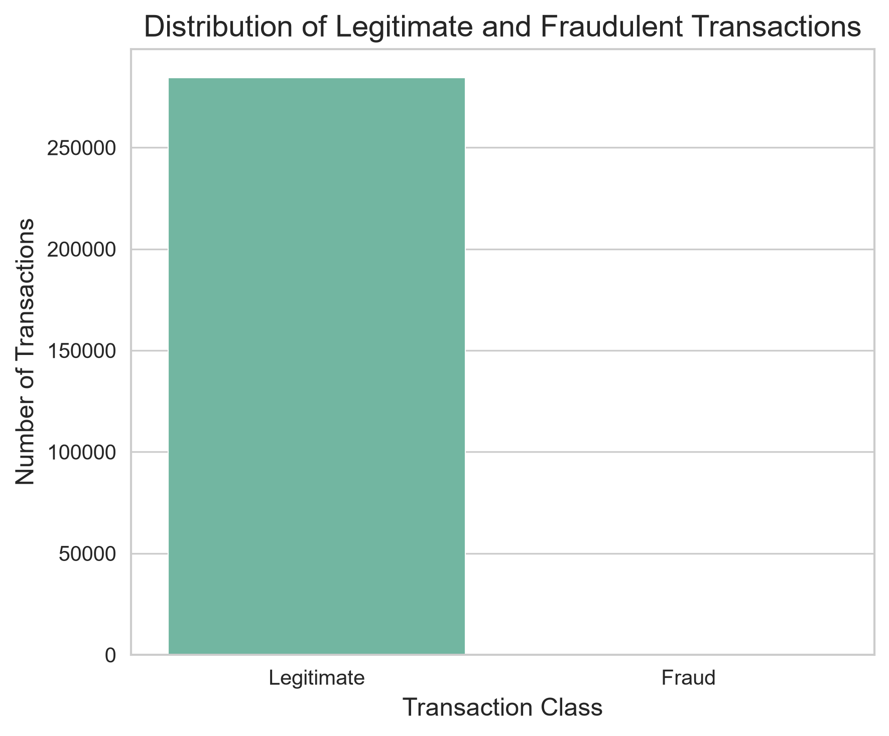
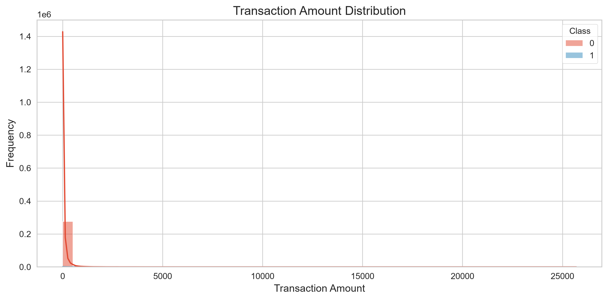
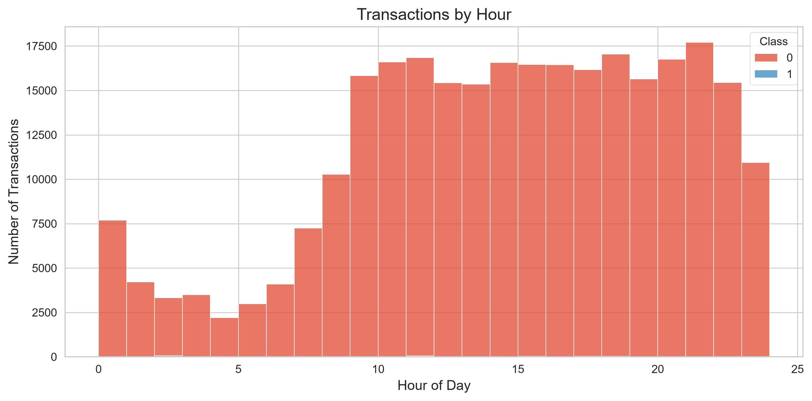
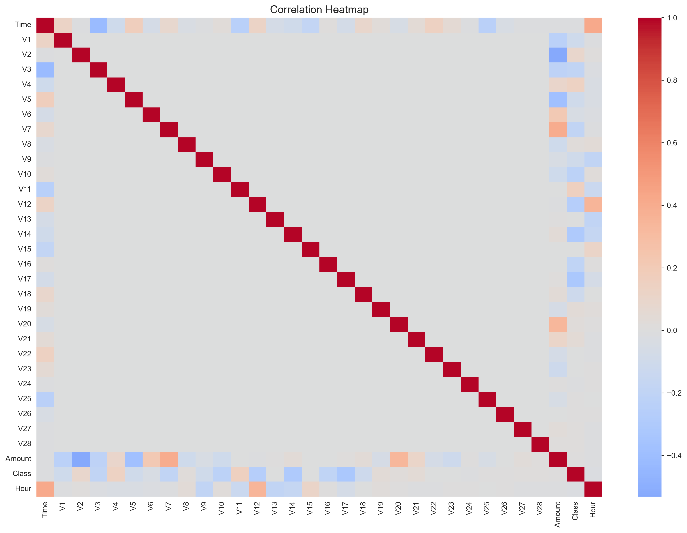
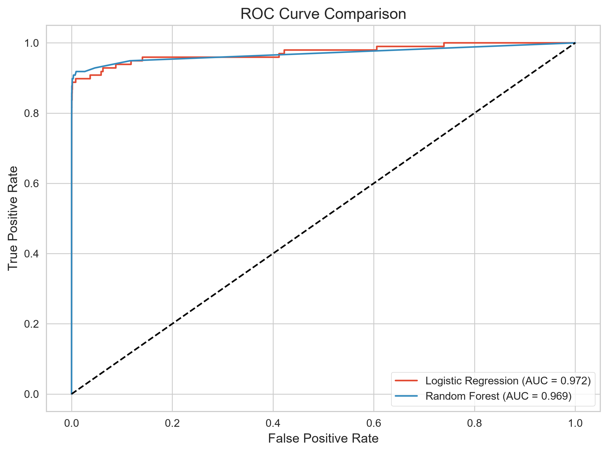
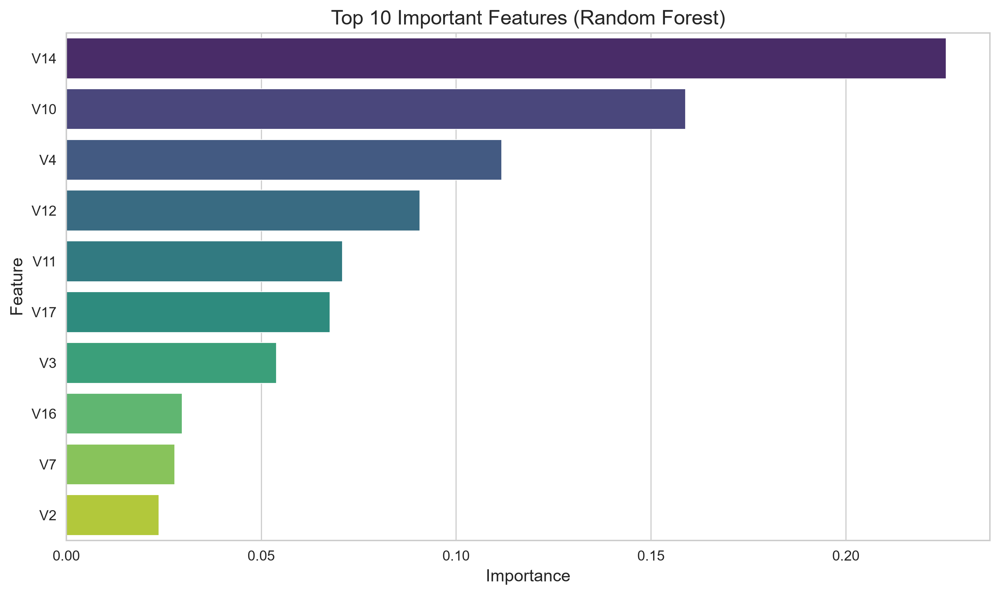

# 💳 Credit Card Fraud Detection using Machine Learning


## 📌 Project Overview

This project was completed as part of the **Oasis Infobyte Data Analytics Internship (Level 2)**.

The objective is to build a machine learning model capable of detecting fraudulent credit card transactions using historical transaction data. Since fraudulent transactions account for only a tiny fraction of all transactions, the project focuses on handling class imbalance, training classification models, and evaluating them using appropriate metrics.

---

## 🎯 Objectives

- Load and explore the credit card transaction dataset
- Analyze class imbalance
- Perform Exploratory Data Analysis (EDA)
- Handle imbalanced data using SMOTE
- Train multiple machine learning models
- Compare model performance
- Identify the most important features influencing predictions
- Recommend the best model for fraud detection

---

## 📂 Dataset

**Dataset:** Credit Card Fraud Detection Dataset

The dataset contains anonymized credit card transactions made by European cardholders.

### Features

- **Time** – Seconds elapsed between each transaction and the first transaction
- **Amount** – Transaction amount
- **V1 – V28** – PCA-transformed anonymized features
- **Class**
  - **0** → Legitimate Transaction
  - **1** → Fraudulent Transaction

Dataset Summary:

- **284,807 transactions**
- **492 fraudulent transactions**
- **Highly imbalanced dataset**

---

## 🛠 Technologies Used

- Python
- Pandas
- NumPy
- Matplotlib
- Seaborn
- Scikit-Learn
- Imbalanced-Learn (SMOTE)
- Jupyter Notebook

---

## 📁 Project Structure

```text
DataAnalytics-L2-FraudDetection/
│
├── data/
│   └── creditcard.csv
│
├── notebook/
│   └── Fraud_Detection.ipynb
│
├── images/
│   ├── class_distribution.png
│   ├── transaction_amount_distribution.png
│   ├── fraud_amount_boxplot.png
│   ├── transactions_by_hour.png
│   ├── correlation_heatmap.png
│   ├── logistic_confusion_matrix.png
│   ├── random_forest_confusion_matrix.png
│   ├── roc_curve.png
│   └── feature_importance.png
│
├── outputs/
│   ├── logistic_report.txt
│   └── random_forest_report.txt
│
├── requirements.txt
└── README.md
```

---

# 🔍 Exploratory Data Analysis

The following analyses were performed:

- Dataset inspection
- Missing value analysis
- Class imbalance analysis
- Transaction amount distribution
- Fraud vs legitimate amount comparison
- Transaction time analysis
- Correlation heatmap

---

# ⚙️ Machine Learning Workflow

1. Load dataset
2. Explore and clean data
3. Perform EDA
4. Split data into training and testing sets
5. Handle class imbalance using SMOTE
6. Train Logistic Regression
7. Train Random Forest
8. Evaluate both models
9. Compare performance
10. Analyze feature importance

---

# 🤖 Models Used

## Logistic Regression

A simple baseline classification algorithm that predicts fraud using a linear decision boundary.

## Random Forest

An ensemble learning algorithm that combines multiple decision trees to improve prediction accuracy and robustness.

---

# 📊 Model Evaluation

The models were evaluated using:

- Precision
- Recall
- F1-Score
- ROC-AUC Score
- Confusion Matrix

These metrics provide a better assessment than accuracy because the dataset is highly imbalanced.

---

# 🏆 Results

| Model | Precision | Recall | F1 Score | ROC-AUC |
|--------|----------:|--------:|----------:|---------:|
| Logistic Regression | 0.121 | 0.898 | 0.213 | 0.972 |
| Random Forest | **0.847** | **0.847** | **0.847** | 0.969 |

### Best Performing Model

**Random Forest** achieved the best overall balance between detecting fraudulent transactions and minimizing false alarms.

Although Logistic Regression achieved slightly higher Recall, it generated many false positives. Random Forest provided much higher Precision while maintaining strong Recall, making it more suitable for real-world fraud detection.

---

# 📈 Key Visualizations

## Class Distribution



---

## Transaction Amount Distribution



---

## Transaction Time Analysis



---

## Correlation Heatmap



---

## ROC Curve Comparison



---

## Feature Importance



---

# 💡 Business Insights

- Fraudulent transactions represent only a very small percentage of all transactions.
- Accuracy alone is misleading for highly imbalanced datasets.
- SMOTE effectively balances the training data and improves fraud detection.
- Random Forest provides the best trade-off between fraud detection and false alarms.
- Important features such as **V14**, **V10**, and **V4** contribute significantly to the model's decisions.

---

# ⚠️ Limitations

- The dataset contains anonymized PCA-transformed features, making feature interpretation difficult.
- Fraud patterns evolve over time and models require periodic retraining.
- SMOTE generates synthetic samples that may not perfectly represent real-world fraud cases.
- The project is intended for offline analysis rather than production deployment.

---

# 🚀 Future Improvements

- Hyperparameter tuning
- XGBoost and LightGBM implementation
- Threshold optimization
- Real-time fraud detection using FastAPI
- Continuous model monitoring and retraining

---

# ▶️ How to Run

Clone the repository:

```bash
git clone https://github.com/deborah455/DataAnalytics-L2-FraudDetection.git
```

Navigate into the project:

```bash
cd DataAnalytics-L2-FraudDetection
```

Install dependencies:

```bash
pip install -r requirements.txt
```

Launch Jupyter Notebook:

```bash
jupyter notebook
```

Open:

```
Fraud_Detection.ipynb
```

Run all cells.

---

# 👩‍💻 Author

**Deborah K.**


Oasis Infobyte Data Analytics Intern

GitHub: https://github.com/deborah455

---

## ⭐ Acknowledgements

- Oasis Infobyte
- Kaggle
- Scikit-Learn
- Pandas
- Imbalanced-Learn