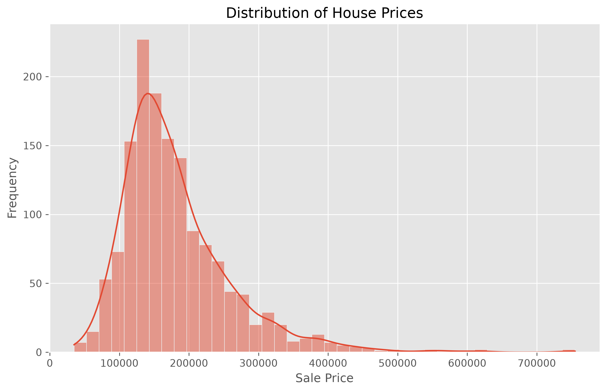
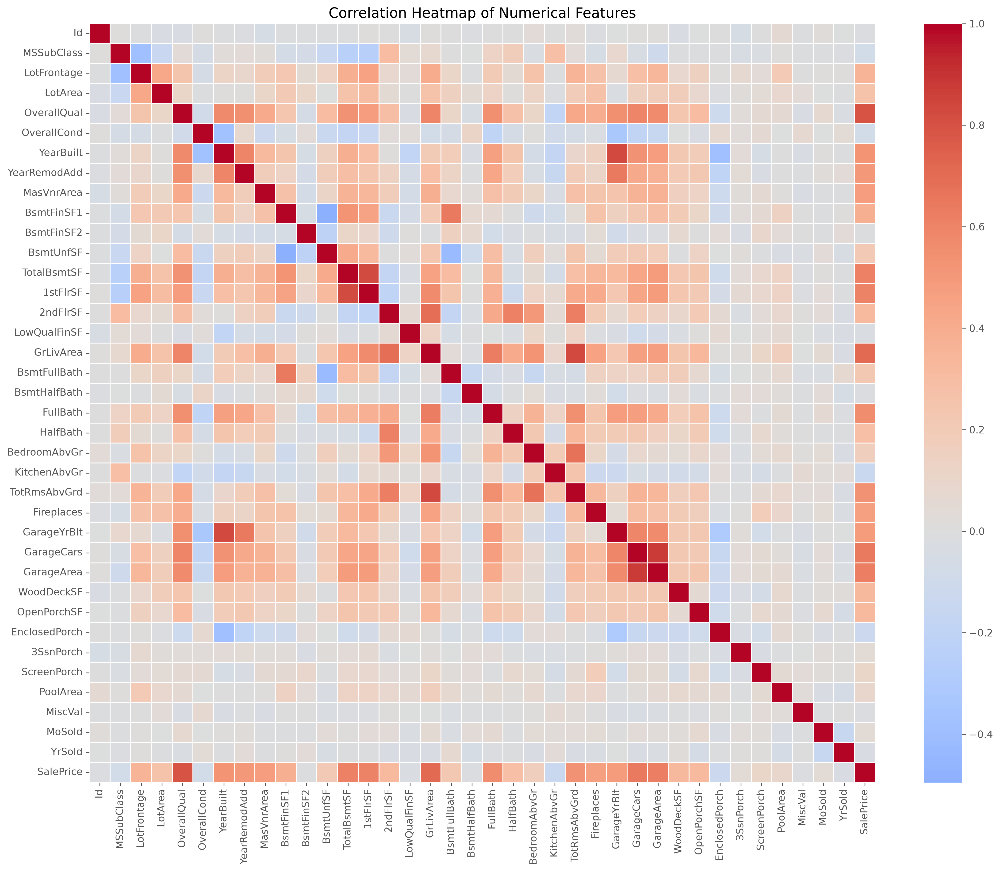
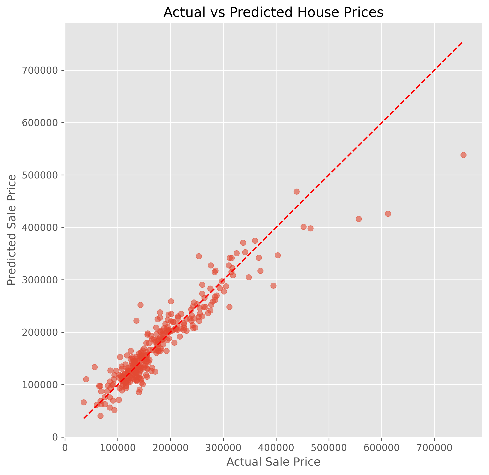
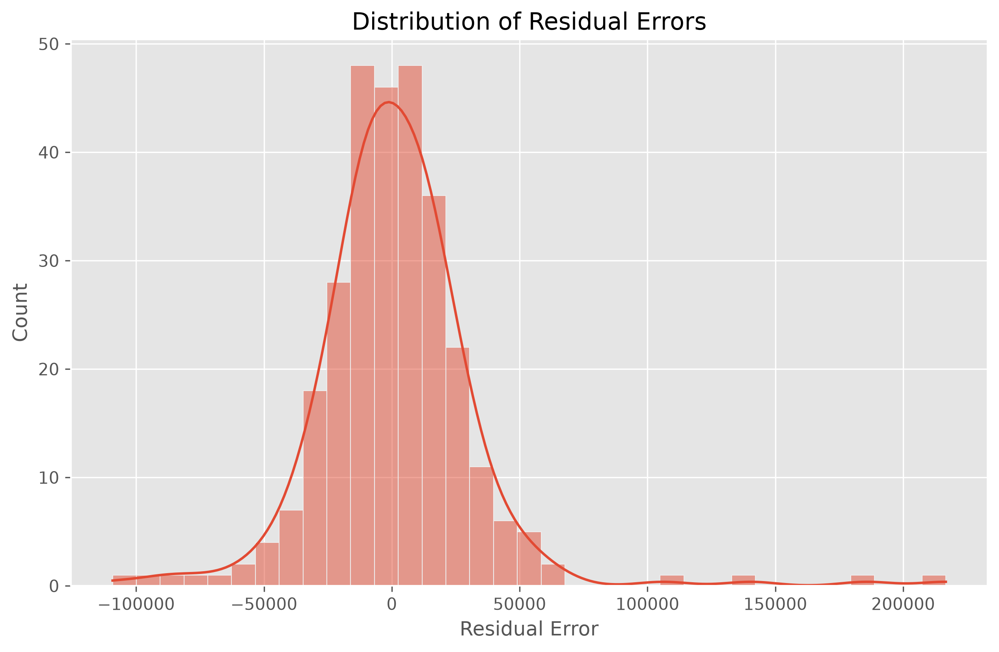
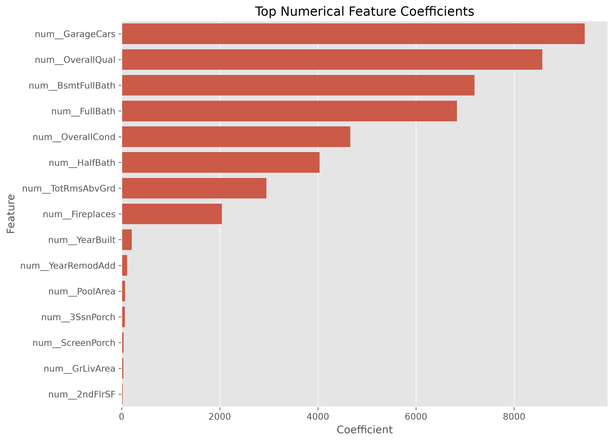

# 🏠 House Price Prediction using Linear Regression

> A machine learning project developed as part of the **Oasis Infobyte Data Analytics Internship (Level 2 – Task 2)**. This project builds a predictive model that estimates house prices based on various property characteristics using **Linear Regression**. It demonstrates the complete machine learning workflow, from data exploration and preprocessing to model evaluation and interpretation.

---

## 📌 Table of Contents

- [Project Overview](#-project-overview)
- [Objectives](#-objectives)
- [Dataset](#-dataset)
- [Tech Stack](#-tech-stack)
- [Project Structure](#-project-structure)
- [Exploratory Data Analysis](#-exploratory-data-analysis)
- [Data Preprocessing](#-data-preprocessing)
- [Model Development](#-model-development)
- [Model Performance](#-model-performance)
- [Sample Predictions](#-sample-predictions)
- [Key Findings](#-key-findings)
- [Recommendations](#-recommendations)
- [Future Improvements](#-future-improvements)
- [Installation](#-installation)
- [Author](#-author)

---

# 📖 Project Overview

Accurately predicting house prices is an important task in the real estate industry. This project applies **Linear Regression** to estimate house prices using property features such as overall quality, living area, garage capacity, basement size, neighborhood, and construction year.

The project covers the complete machine learning workflow:

- Exploratory Data Analysis (EDA)
- Data Cleaning
- Feature Engineering
- Data Preprocessing
- Model Training
- Model Evaluation
- Business Insights
- Recommendations

---

# 🎯 Objectives

- Explore and understand the housing dataset.
- Identify important factors affecting house prices.
- Handle missing values appropriately.
- Encode categorical variables.
- Build a Linear Regression prediction model.
- Evaluate model performance using regression metrics.
- Interpret feature importance.
- Provide actionable business insights.

---

# 📂 Dataset

**Dataset:** House Prices – Advanced Regression Techniques

The dataset contains residential property information including:

- Overall Quality
- Overall Condition
- Living Area
- Basement Area
- Garage Capacity
- Number of Bathrooms
- Number of Rooms
- Year Built
- Neighborhood
- Sale Price (Target Variable)

---

# 🛠️ Tech Stack

- Python
- Jupyter Notebook
- Pandas
- NumPy
- Matplotlib
- Seaborn
- Plotly
- Scikit-learn

---

# 📁 Project Structure

```text
DataAnalytics-L2-HousePricePrediction/
│
├── data/
│   ├── train.csv
│   ├── test.csv
│   ├── sample_submission.csv
│   └── data_description.txt
│
├── images/
│   ├── 01_saleprice_distribution.png
│   ├── 02_saleprice_boxplot.png
│   ├── 03_correlation_heatmap.png
│   ├── 04_top_feature_correlations.png
│   ├── 05_actual_vs_predicted.png
│   ├── 06_residual_plot.png
│   ├── 07_residual_distribution.png
│   ├── 08_top_positive_coefficients.png
│   └── 09_numerical_feature_coefficients.png
│
├── notebook/
│   └── HousePricePrediction.ipynb
│
├── outputs/
├── powerbi/
│
├── README.md
└── requirements.txt
```

---

# 📊 Exploratory Data Analysis

The dataset was explored to understand its structure, identify missing values, detect outliers, and discover relationships between variables.

The following analyses were performed:

- Dataset Inspection
- Missing Value Analysis
- Descriptive Statistics
- Sale Price Distribution
- Boxplot Analysis
- Correlation Analysis
- Top Feature Correlations

## 📈 Sale Price Distribution



The distribution is **right-skewed**, indicating that most houses are sold within the lower-to-middle price range while relatively few luxury properties exist.

---

## 🔥 Correlation Heatmap



The heatmap shows strong positive correlations between **Overall Quality**, **Garage Capacity**, **Living Area**, and **Sale Price**, indicating these are important predictors.

---

# ⚙️ Data Preprocessing

The following preprocessing steps were applied before model training:

- Median imputation for numerical features
- Most frequent imputation for categorical features
- One-Hot Encoding of categorical variables
- ColumnTransformer Pipeline
- 80/20 Train-Test Split

These steps ensure the dataset is clean and suitable for machine learning.

---

# 🤖 Model Development

A **Linear Regression** model was trained using Scikit-learn's Pipeline.

To compare performance, a **Ridge Regression** model was also trained.

The trained model learns relationships between house characteristics and sale prices, enabling it to estimate prices for previously unseen houses.

---

# 📈 Model Performance

## Linear Regression

| Metric | Value |
|---------|--------|
| Mean Squared Error (MSE) | **981,430,763.46** |
| Root Mean Squared Error (RMSE) | **31,327.80** |
| R² Score | **0.8720** |

## Ridge Regression

| Metric | Value |
|---------|--------|
| RMSE | **34,631.48** |
| R² Score | **0.8436** |

### Model Evaluation

The Linear Regression model achieved an **R² Score of 0.8720**, meaning it explains approximately **87.2%** of the variation in house prices.

The comparison also showed that Linear Regression performed better than Ridge Regression for this dataset.

---

## 🎯 Actual vs Predicted Prices



Most predicted values closely follow the actual house prices, demonstrating good predictive performance. Larger prediction errors are primarily observed for higher-priced luxury properties.

---

## 📉 Residual Distribution



The residuals are approximately centered around zero, suggesting that the model does not exhibit significant systematic bias.

---

# 🔍 Sample Predictions

After training, the model successfully predicted house prices for unseen test data.

Each prediction includes:

- Actual Sale Price
- Predicted Sale Price
- Prediction Difference (Error)

Comparing predictions with actual values provides a practical demonstration of the model's effectiveness beyond evaluation metrics alone.

---

# 📊 Feature Importance

## Numerical Feature Coefficients



Among numerical variables, the most influential positive predictors include:

- Garage Capacity
- Overall Quality
- Basement Bathrooms
- Full Bathrooms
- Overall Condition
- Number of Rooms

These features contribute significantly to increasing predicted house prices.

---

# 💡 Key Findings

The analysis revealed that:

- Garage capacity is one of the strongest numerical predictors of house prices.
- Overall construction quality significantly increases property value.
- Larger living areas generally result in higher house prices.
- Basement features and bathrooms positively influence property prices.
- Premium neighborhoods command significantly higher prices.
- Linear Regression provides strong predictive performance for this dataset.

---

# ✅ Recommendations

Based on the analysis:

- Invest in higher-quality construction materials.
- Improve garage capacity where possible.
- Increase usable living space.
- Maintain property condition through renovations.
- Consider neighborhood characteristics during valuation.
- Explore advanced regression models such as Random Forest, Gradient Boosting, and XGBoost for future improvements.

---

# 🚀 Future Improvements

Future enhancements may include:

- Interactive Power BI Dashboard
- Hyperparameter Tuning
- Feature Engineering
- Random Forest Regression
- XGBoost Regression
- Model Deployment using Flask or Streamlit
- Real-time House Price Prediction API

---

# ⚡ Installation

Clone the repository

```bash
git clone https://github.com/deborah455/DataAnalytics-L2-HousePricePrediction.git
```

Navigate to the project

```bash
cd DataAnalytics-L2-HousePricePrediction
```

Install dependencies

```bash
pip install -r requirements.txt
```

Launch Jupyter Notebook

```bash
jupyter notebook
```

---

# 👩‍💻 Author

**Deborah K.**

Bachelor of Science in Information Technology

Python • Machine Learning • Data Analytics • Computer Vision • Automation

GitHub: https://github.com/deborah455

---

# 📜 License

This project was developed as part of the **Oasis Infobyte Data Analytics Internship (Level 2)**.